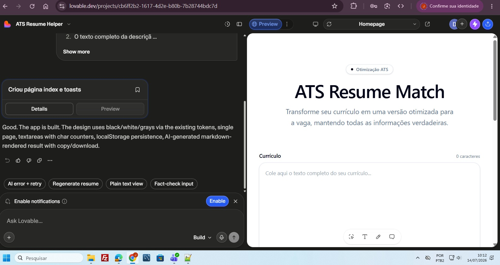
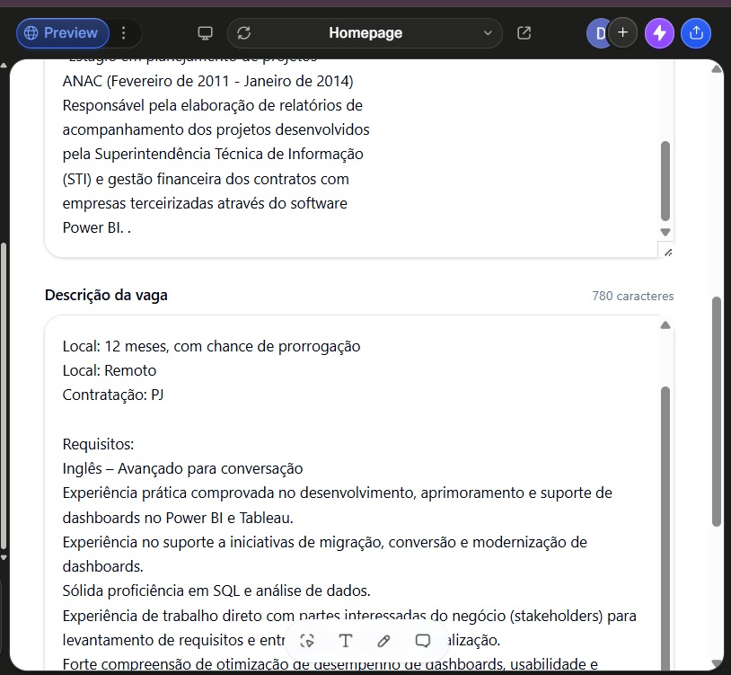
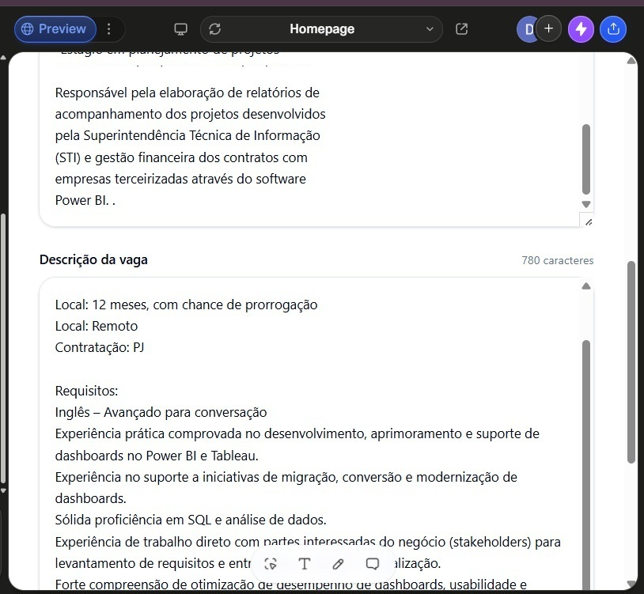

# DIO - Criando um Gerador de Currículos ATS Friendly com Lovable

Estes são os arquivos e os prompts utilizados para criar a aplicação de Geração de Currículos ATS Friendly com Lovable. Este foi o desafio do bootcamp Riachuelo - Criando produtos com IA, feito pela DIO em julho de 2026.

O objetivo do sistema é o usuário inserir um texto contendo o seu currículo e um outro texto contendo a descrição da vaga. O resultado gerado é um novo currículo, compatível com a vaga. 

Os prompts utilizados ficam na pasta /prompts.

Na pasta /evidencias estão disponiveis o curriculo utilizado no teste, a descrição da vaga e o resultado gerado pelo sistema. Algumas informações foram retiradas destes arquivos antes de armazenar no GitHub.

A seguir, telas do sistema.

